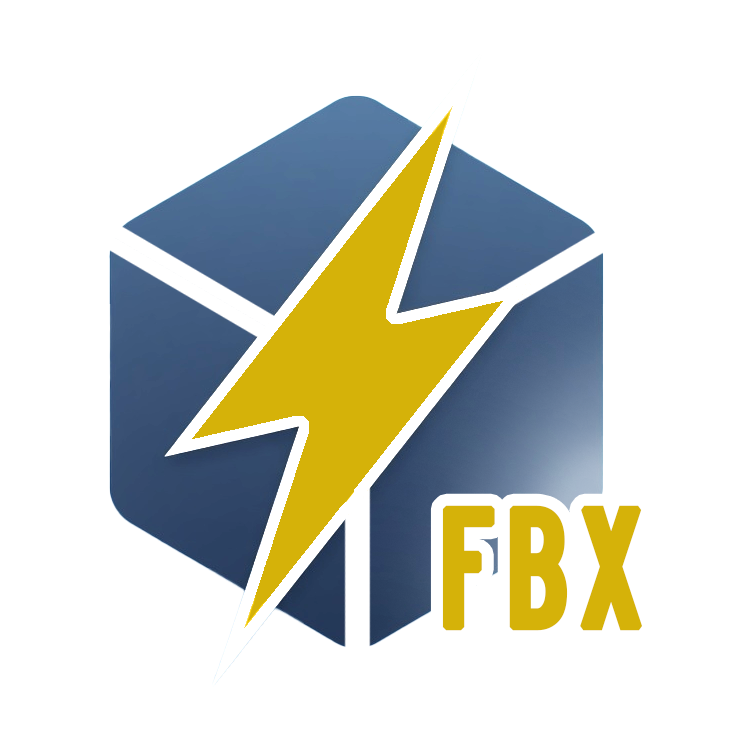
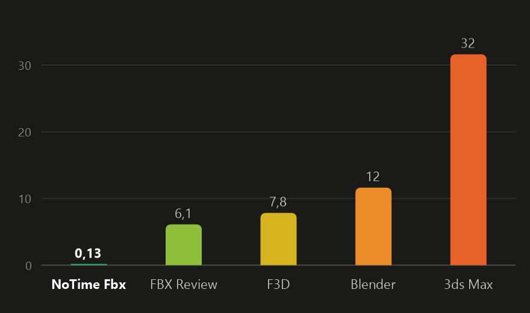
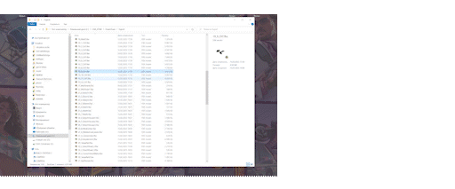

[English](README.md) | **Русский**

# NoTime Fbx

Очень быстрый просмотрщик FBX для Windows. Двойной щелчок по `.fbx` — и модель на экране
примерно через 10–20 мс; её можно только вращать и приближать, больше ничего.

> Работает на **WARP**. Да, как варп-двигатель: пока другие программы добираются до модели на
> досветовой, NoTime Fbx просто искривляет пространство-время — и модель уже на экране.
> *(Скучная правда: WARP — это программный Direct3D от Microsoft, которому не нужно ждать драйвер видеокарты.)*

## Скорость

<table>
  <tr>
    <td></td>
    <td align="center"><br><sub><i>Это единственное, с чем я могу сравнить</i></sub></td>
  </tr>
</table>

Среднее время от запуска программы до модели на экране, в секундах, по пяти моделям от 1 тыс. до
2,4 млн треугольников (Windows 10, RTX 4060). FBX Review не открыл самую тяжёлую модель — его среднее
посчитано по четырём.

## Установка

Скачайте `NoTimeFbx-setup.exe` со страницы [Releases](../../releases) и запустите. Программа
ставится для текущего пользователя (права администратора не нужны) в `%LOCALAPPDATA%\Programs\NoTimeFbx`,
добавляет ярлык в «Пуск» и предлагает открывать ею файлы `.fbx`. Удаление — через
«Параметры → Приложения».

`NoTimeFbx-setup.exe` — это сама программа: если переименовать его в `NoTimeFbx.exe`, он работает
как обычный просмотрщик без установки.

## Управление

| Действие | Как |
|---|---|
| Вращать | левая кнопка мыши |
| Приблизить / отдалить | колесо |
| Открыть другой файл | перетащить `.fbx` в окно |
| Закрыть | Esc |

## Что внутри

- **Быстрый старт.** Лёгкие модели (до ~150 тыс. треугольников) рисуются через WARP — программный
  Direct3D 11 от Microsoft, который готов за ~5 мс вместо ~140 мс на загрузку драйвера видеокарты.
  Тяжёлые модели сразу идут на видеокарту; если WARP не успевает (большое окно, медленный CPU),
  модель переезжает на видеокарту на лету.
- **Параллельная загрузка.** Файл разбирается ([ufbx](https://github.com/ufbx/ufbx)) на всех ядрах,
  пока создаются окно и Direct3D.
- **Кэш.** Модели от 8 МБ после первого открытия сохраняются в готовом виде
  (`%LOCALAPPDATA%\NoTimeFbx\cache`, не больше 2 ГБ) — повторное открытие без разбора FBX.
- **Текстуры** подгружаются после первого кадра: PNG, JPEG, TIFF, BMP, DDS, TGA; вырезы (листва,
  сетки) определяются автоматически.
- Бинарные и ASCII FBX, в том числе файлы из «kn5 converter» (Assetto Corsa).

## Сборка

Нужны MSVC (Visual Studio 2022 или новее, компонент «Разработка классических приложений на C++»)
и Windows SDK 10.0.22621 или новее. Затем:

```
build.bat          :: релиз: build\NoTimeFbx.exe и build\NoTimeFbx-setup.exe
build.bat debug    :: отладочная сборка
```

Иконка собирается из `icon.png`: `powershell -ExecutionPolicy Bypass -File res\make_icon.ps1`.

### Переменные окружения для диагностики

| Переменная | Что делает |
|---|---|
| `NOTIMEFBX_TIMING=1` | время запуска по этапам в заголовке окна |
| `NOTIMEFBX_LOG=1` | лог в `%TEMP%\NoTimeFbx.log` (материалы, текстуры, выбор рендерера) |
| `NOTIMEFBX_NOCACHE=1` | не использовать кэш |
| `NOTIMEFBX_RENDERER=gpu\|warp` | принудительно выбрать рендерер |
| `NOTIMEFBX_WARP_MAX_TRIS=N` | порог треугольников для WARP (по умолчанию 150000) |

## Лицензия

MIT, см. [LICENSE](LICENSE). Включённая библиотека [ufbx](https://github.com/ufbx/ufbx) — под своей
лицензией (MIT / Public Domain, `third_party/ufbx/LICENSE`), с небольшой правкой, описанной в
`third_party/ufbx/PATCHES.txt`.
